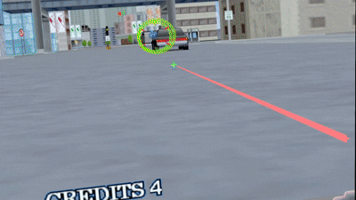

# Virtua Cop 2 VR (VC2VR) — beta

**Beta release.** Shooting, aiming, zoom and menus work end to end; some level
sections still show draw-order glitches (see Known issues). Feedback welcome.



A native VR mod for the 1997 PC port of **Virtua Cop 2**. Not a flat screen in a
headroom — the mod intercepts the game's software renderer, reconstructs the real
3D scene from the geometry the engine projects every frame, and re-renders it
for your headset through OpenXR, with the game's original textures, lighting and
sky. Your motion controller is the light gun: point and shoot, exactly like the
arcade cabinet.

* Full 6DoF view of the actual level geometry (look around corners the flat
  game never showed)
* Motion-controller light gun with a laser sight — where the laser points is
  where the game registers the hit, at any zoom level
* The game's own cinematic zoom moments are mirrored in VR automatically
* Menus, cutscenes and score screens appear on a floating screen you can click
  with the laser
* No game files are modified on disk

## Requirements

* Your own copy of **Virtua Cop 2 for PC** (1997). No game files are included
  in this mod and none ever will be.
* A PC VR headset with an OpenXR runtime (SteamVR, Oculus/Meta Link, etc.)
* Windows, x64

## Installation

The 1997 game loads its data from `..\BIN\` - one level ABOVE its working
directory. A default install puts `PPJ2DD.EXE` in the game root next to the
`BIN` folder, so launched from there it cannot find its own data (it then
goes hunting for a CD and dies with `not found <drive>:\...\MOTCMN.BIN`).
The fix is a subfolder:

```
<game folder>\
  BIN\        <- game data, already there
  PROJECT\    <- CREATE this folder
```

1. Create a `PROJECT` folder inside the game folder and copy ALL files
   from the game root into it - files only, not the folders (`BIN` stays
   where it is). Check that the game runs from there on its own. Always start it with `PROJECT` as the working
   directory - a shortcut with an empty "Start in" field brings the
   data error back.
2. Copy `HGL_VIEW.DLL` and `HGL_VIEW.ini` into that `PROJECT\` folder too.
3. Put `VC2VR.exe`, `VC2VR.ini` and `openxr_loader.dll` together in any folder
   (they do not need to be near the game).
4. That is all - no wrappers or other third-party files are needed.

## Running

1. Start your VR runtime (e.g. SteamVR).
2. Start the game. The graphics selector lists the game's own renderers
   (Direct Draw, Direct 3D) plus **Direct 3D + 3D view** - that entry IS the
   mod (it proxies the game's Direct 3D renderer). Pick it. The choice is
   remembered in `vcop2.ini`, so this is a one-time step per install.
3. Start a level.
4. Run `VC2VR.exe` and put the headset on. The mod pulls the game window to the
   front by itself (the game pauses when unfocused), finds the game process and
   starts mirroring. Stand facing your monitor at that moment — the first head
   pose becomes the camera.

If the game itself dies on start with `not found ...BIN\MOTCMN.BIN` (or a
similar `.BIN` path on some drive letter), it could not find its data: the
`BIN` folder is not one level above the working directory - the exe is
still in the game root, or the shortcut's "Start in" is wrong. See the
Installation section; this is the game's own loader, not the mod.

If VR input works but no picture arrives (the `--window` title shows 0
triangles): the game is drawing through a different renderer. The mod's hooks
install as soon as the game scans its renderer DLLs, but geometry only flows
when **Direct 3D + 3D view** is the selected device - pick it again in the
selector, or carry your old `vcop2.ini` over.

If the headset shows "waiting for the game": the D3D + 3D view mode was not
selected, or `share=0` in HGL_VIEW.ini. `VC2VR.exe --window` renders to a flat
window instead of the headset, which is useful to tell a game-side problem from
a VR-runtime problem.

## Controls

| Input                    | Action                                        |
|--------------------------|-----------------------------------------------|
| Trigger                  | Fire (the hand that fired last holds the gun) |
| A / X                    | Reload (Start / Enter in menus)               |
| B / Y                    | Back (Esc)                                    |
| Thumbstick — flick up    | Zoom toggle (flick again to drop it)          |
| Thumbstick — click       | Floating menu screen: auto / always / off     |
| Grip (squeeze)           | Recenter view                                 |

## Configuration

`VC2VR.ini` (VR side): `msaa`, `supersample`, `zoom` (magnification cap, %),
`zoomspeed` (glide speed), `autozoom` (follow the game's own cinematic zoom),
`hidecross` (hide the game's flat crosshair sprite, the laser replaces it),
`aimreach` (where the laser ends on a miss, metres), `focusgame`.

`HGL_VIEW.ini` (game side): `units_per_metre` (world scale; smaller if the
world feels like a dollhouse, larger if gigantic), capture and rendering keys.
Both files are commented.

## How it works (short version)

The game draws through a pluggable renderer DLL (`HGL_D3D.DLL`). This mod's
`HGL_VIEW.DLL` sits in front of it, reads every textured quad the engine
submits, and un-projects it back into 3D using the projection values the game
is using *that frame* (the engine changes its FOV at runtime). Decoded textures,
geometry and the engine's own depth keys go into shared memory. A separate
64-bit process, `VC2VR.exe`, renders that scene for both eyes via OpenXR — two
processes because a 32-bit game and a 64-bit VR runtime cannot share one.
Controller aim is ray-cast against the reconstructed scene and the hit is
projected back through the game's live camera into the game's own light-gun
input, so the laser and the game always agree on where you shot.

## Known issues

* Occasional draw-order glitches on some level sections (engine blend/fog
  flags are not fully decoded yet).
* Magnified view amplifies head shake — physics, not a bug; lower the `zoom`
  cap if it bothers you.
* If the floating menu screen stays black, run the game windowed — the
  screen capture cannot see an exclusive-fullscreen window.

## Building from source

Cross-compiles from Linux with mingw-w64. OpenXR headers: `include/openxr/*.h`
from [OpenXR-SDK](https://github.com/KhronosGroup/OpenXR-SDK) tag
`release-1.0.34` into `./oxr/openxr/`.

```
x86_64-w64-mingw32-gcc -O2 -s -I oxr -o VC2VR.exe src/vc2vr.c \
    -ld3d11 -ld3dcompiler -ldxgi -ldxguid -luser32
i686-w64-mingw32-gcc  -O2 -s -shared -o HGL_VIEW.DLL src/hgl_view.c \
    -Wl,--kill-at -ld3d11 -ld3dcompiler -luser32 -lgdi32 -ldxguid
```

`vc2vr.c` builds the exact released VC2VR.exe. `hgl_view.c` is the full
renderer of the released DLL, but the released binary additionally contains a
small (~3.5 KB) joystick input module that emulates the light gun for the
game; its source is being reconstructed and will land in this repo - until
then a DLL built from this file renders but does not shoot. Use the released
DLL.

## Legal

This mod contains **no assets or code from Virtua Cop 2**. It is a fan-made
interoperability project provided as-is, free, for owners of the original
game. Virtua Cop 2 is © SEGA. Not affiliated with or endorsed by SEGA.
`openxr_loader.dll` is from the Khronos OpenXR SDK (Apache 2.0).
